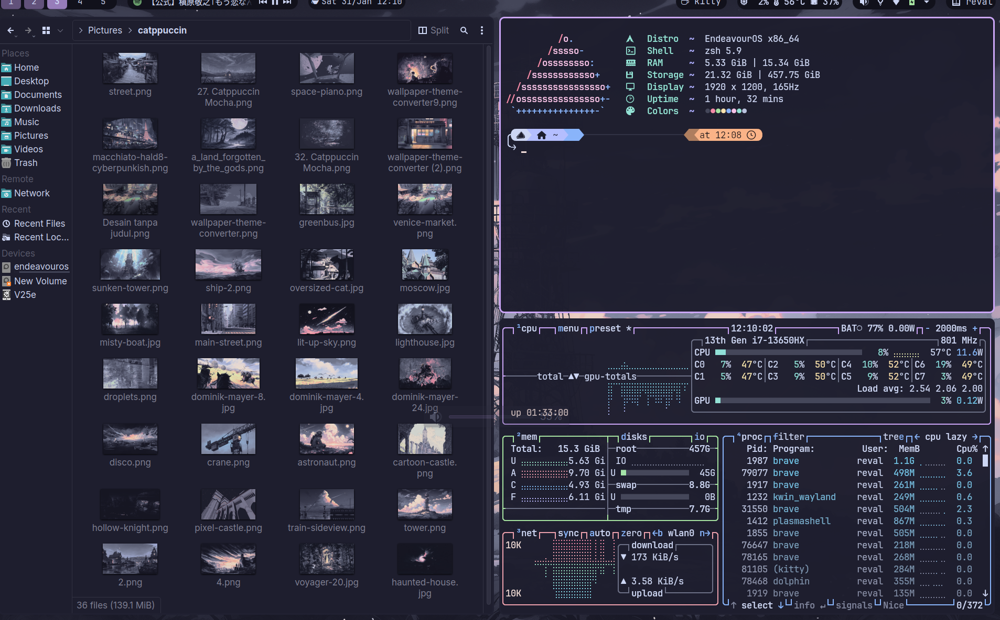

# Rice

my repo for kde plasma dotfiles

Distro      : Endeavour OS

DE          : KDE Plasma

Theme       : catppuccin mocha flamingo: https://store.kde.org/p/2279886

Icons       : Papirus (teal folder): https://github.com/PapirusDevelopmentTeam/papirus-icon-theme

Cursor      : catppuccin mocha (dark): https://github.com/catppuccin/cursors

Font        : inter, Jetbrains mono

Terminal    : kitty

Shell       : zsh

File manager : dolphin

Panel bar   : KDE's own bar with panel colorizer: https://github.com/luisbocanegra/plasma-panel-colorizer

Apps shown in screenshots:
+ terminal : kitty
+ editor : vscode
+ fastfetch : https://github.com/fastfetch-cli/fastfetch
+ btop : https://github.com/aristocratos/btop
+ dolphin

Widgets on panel from left to right:
+ kara: https://github.com/dhruv8sh/kara
+ plasmusic toolbar : https://github.com/ccatterina/plasmusic-toolbar
+ digital clock
+ window title applet : https://github.com/dhruv8sh/plasma6-window-title-applet
+ command output : https://github.com/Zren/plasma-applet-commandoutput (see "scripts" folder)
+ system tray
+ shutdown or switch : https://github.com/Davide-sd/shutdown_or_switch

Notes
+ most of my config is just copy-pasting catppuccin-mocha theme with some minor tweaks, go check them out! : https://github.com/catppuccin
+ resolution : 1920x1200
+ Blur/transparency : none, but kitty opacity at 0,975

